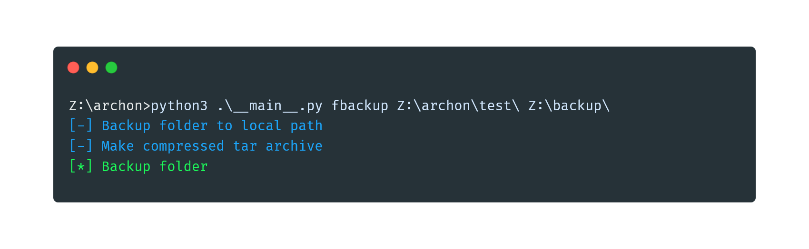

# Archon Backup
Archon is the open source backup solution that will help you protect your files from damage and restore destructed files easily. Archon Backup Utility supports FTP, FTPS and Windows Network Paths. Archon compresses your backups with modern compression algorithms. It's fully written in Python, HTML, CSS and JavaScript. The fresh and easy backup reports will show you the results of any backup task.

First, I want to say thanks to the developers of termcolor. I use termcolor as a module in my application to style the output. Termcolor is licensed under the MIT License. You can find the license text of it under legal/termcolor.txt. I also want to say Thank You to all the other developers of the other python-included libraries I used.

## How to install Archon?
### Run Archon
To use Archon, you just have to download the archon folder and execute the python script in it from the command-line.  
For example: `python3 .\__main__.py`.

### Commands
You can easily use archon with a few simple commands. They are all listed and described down here. Info: "f" means folder and "s" means single.
> Warning: Please always enter the full path. A path has to end with \\.  

| Command 	| Syntax 	| Meaning 	|
|---	|---	|---	|
| sbackup 	| python3 .\\\_\_main\_\_.py sbackup <file_to_backup> <backup_target> 	| Backup a single file to a local or Windows Network Path. 	|
| fbackup 	| python3 .\\\__min__.py fbackup <folder_to_backup> <backup_target> 	| Backup a folder as compressed archive to a local or Windows Network Path. 	|
| frestore 	| python3 .\\__main__.py frestore <backup_to_restore_from> <folder_to_restore> 	| Restore a folder from a backup stored on a local or Windows Network Path. 	|
| frestoreftp 	| python3 .\\__main__.py frestoreftp <backup_to_restore_from> <folder_to_restore> <Use_TLS tls/none>  	| Restore a folder from a backup stored on a ftp server. You will be asked for the login credentials. 	|
| fbackupftp 	| python3 .\\__main__.py fbackupftp <folder_to_backup> <backup_to_restore_from> <Use_TLS tls/none> 	| Backup a folder as compressed archive to a ftp server. You will be asked for the login credentials. 	|
### The Reports
When Archon has finished a backup, it will pop up a report with some information about the backup.
The report also contains a backup history. 
You can also find the history under the assets in the archon base folder as a .csv file.

----
> ‼ __Warning: Archon comes with absolutely no warranty. If something goes wrong and your files are destroyed or can't be restored, I can't be held responsible for this. Archon is used at your own risk.__
